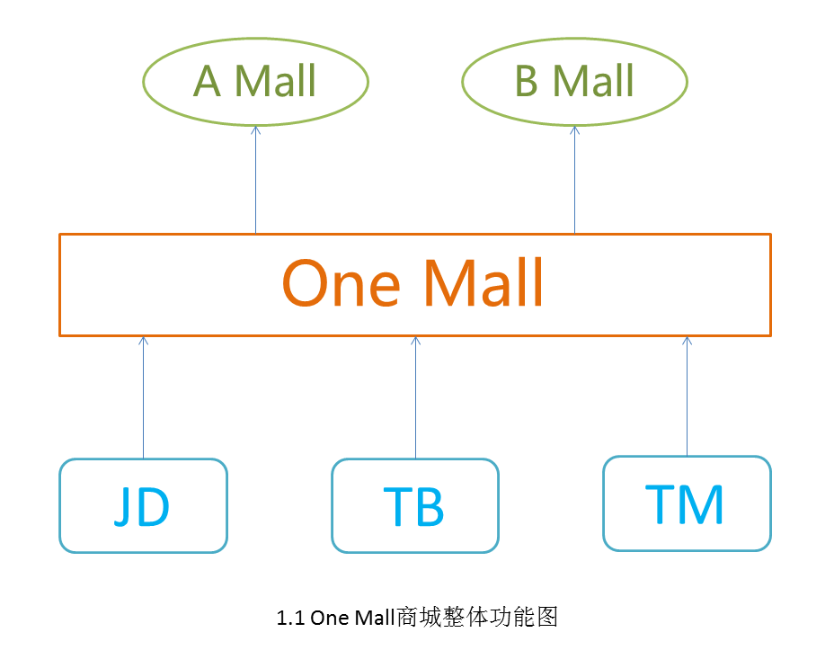
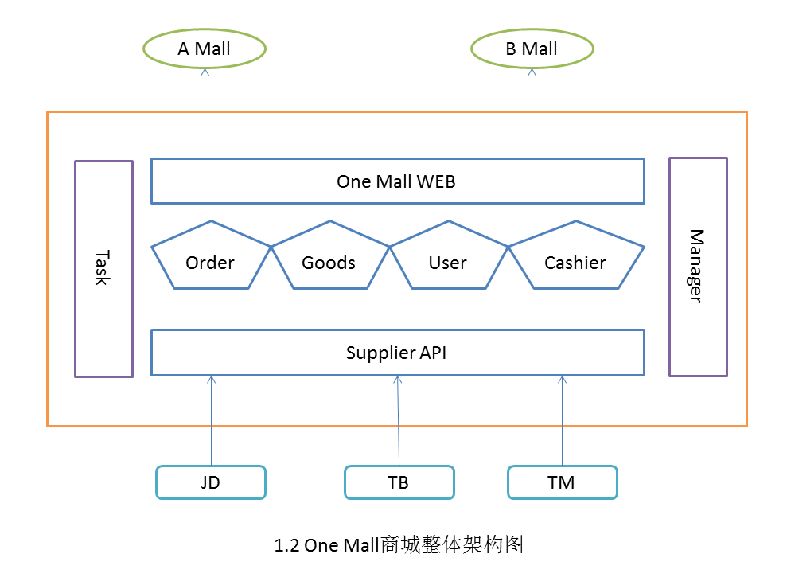

# OneMall
学习不能仅仅是纸上谈兵，尤其是设计模式这种偏理论性的知识。所以我们需要通过一个完整的项目学习一下到底如何在项目中使用这些设计模式。

## 1、项目需求

由于设计模式比较多，而且功能单一的项目也体会不到设计模式的强大,所以构造了一个相对复杂的商城项目。

OneMall 项目的最终目标是统一 JD、TB、TM 等各大商城，提供统一的购物流程。而且还需要具备商城外放能力，整体的功能图如下图所示。

我们假设已经拿到了各大商城的API，其中 AMall、BMall 可以理解为 OneMall 的分销商城，OneMall 提供一套完整的购物、支付、对账等 API 供分销商使用。

## 2. 架构设计

整体的系统采用微服务的架构，前后端分离。主要分为 Web、Order、Goods、User、Cashier、Task、Manager、Supplier 等几个大的模块。

+ One Mall WEB: 前端统一入口
+ Order: 封装订单相关功能
+ Goods: 封装商品相关功能
+ User: 封装用户信息、地址信息，购物车等相关功能
+ Cashier: 封装支付相关功能，提供统一的收银台接口。
+ Task: 封装定时相关功能，包括订单状态的同步，对账等
+ Manager: 后台管理功能，包括商品上下架、订单管理等
+ Supplier 封装各大商城的API接口，提供统一的商城 API

PS: 技术能力有限，不要太在意细节，我们的目的是 **学习设计模式**，不是学习架构设计